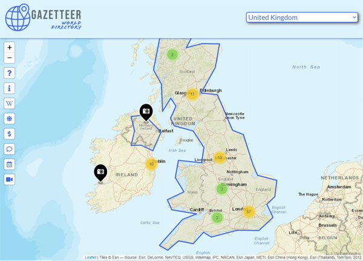
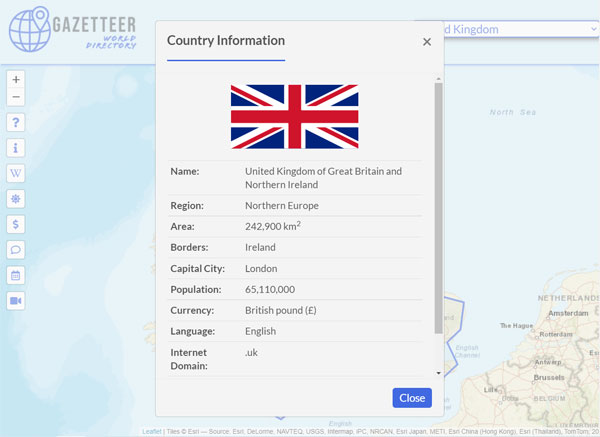
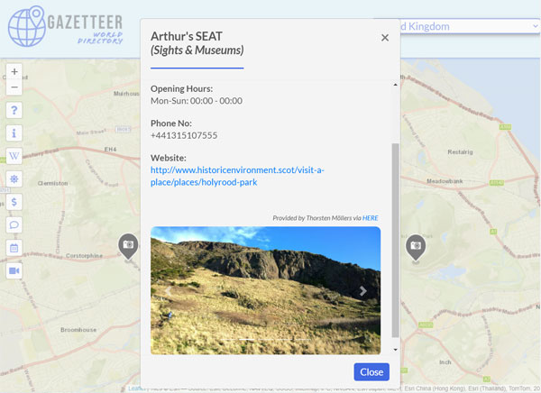

# Gazetteer - World Directory
> A single-page, mapping web application that uses third-party APIs to aggregate and present country information.

## Table of contents
* [General information](#general-information)
* [Screenshots](#screenshots)
* [Technologies](#technologies)
* [Setup](#setup)
* [Features](#features)
* [Project status](#project-status)
* [Contact](#contact)

## General information
* A mobile-first, single-page mapping web application to show data on countries from around the world.
* Integrates the [Leaflet](https://leafletjs.com) JavaScript library for interactive mapping.
* Uses [Bootstrap](https://getbootstrap.com) for a clean, modern, mobile-first design that adapts for larger screens.
* JavaScript/[jQuery](https://jquery.com) to aggregate and present data in an engaging and interactive format.
* Client-side asynchronous AJAX calls, fetching data where required, to maintain a seamless, single-page application experience.
* PHP components using cURL for server-side API integration, to retrieve and return data from a variety of third parties.

## Screenshots

## Technologies
* HTML5
* CSS3
* JavaScript
* jQuery
* Bootstrap
* AJAX
* JSON
* PHP
* cURL

## Setup
* Ensure you have an appropriate PHP server installed and running, e.g. [XAMPP](https://www.apachefriends.org)
* Create and set your own API keys in *'resources -> php -> gazetteerKeys.php'* from the following sources:
    * [$openCageKey](https://opencagedata.com)
    * [$hereKey](https://developer.here.com)
    * [$openWeatherKey](https://openweathermap.org)
    * [$openExchangeRatesKey](https://openexchangerates.org)
    * [$myMemoryKey](https://mymemory.translated.net)
    * [$windyKey](https://api.windy.com/webcams)

## Features
* Country selection.
* Full-screen, worldwide map with multiple zoom levels, supporting tap and pinch-to-zoom on mobile.
* Selected country border identification on map.
* Up to one hundred of the most popular sights, museums and tourist attractions in and around the selected country, overlaid as markers on the map.
    * Map markers may be clicked for further information; includes (where available) address, contact details, website, opening times and image gallery.
* Buttons overlaid on the map to give the following information (where available) on the selected country:
    * **General country information** - shows data including area, borders, capital city, population, currency, language(s), etc.
    * **Wikipedia information** - an image gallery and overview of the country from Wikipedia.
    * **Weather forecast** - a four-day weather forecast for the selected country.
    * **Currency converter** - convert to and from the selected country's currency using near-real-time exchange rates, or select any two currencies from around the world to perform the conversion.
    * **Language translation** - translate English text into the selected country's language(s).
    * **Public holidays** - lists all of the current year's public holidays for the selected country, with links for further reading on Wikipedia.
    * **Webcams** - shows a timelapse of the last twenty-four hours from up to three of the most popular webcams from the selected country.

## Project status
* Complete

## Contact
* Created by Chris Walker
* [chrismwalker.co.uk](https://chrismwalker.co.uk)